# Notes for Angular

Before you start, we suggest reading through our [Angular Handbook](https://infinum.com/handbook/books/frontend/angular/introduction) and going through the official [Tour of Heroes tutorial](https://angular.io/tutorial) before starting this project as it explains many Angular features along the way.

## 1. Application requirements & notes

When implementing the application, please:

- Choose some nice prefix
- Use lazy loading of modules
- Use SCSS
- Use OnPush change detection
  - Run this command right after you generate the project
    ```bash
    ng config schematics.@schematics/angular.component.changeDetection OnPush
    ```
  - When using OnPush CD, [use async pipe at much as possible](https://infinum.com/handbook/books/frontend/angular/angular-guidelines-and-best-practices/formatting-naming-and-best-practices#avoid-manual-subscriptions-and-asynchronous-property-assignment)
- Use [Angular Material](https://material.angular.io/guide/getting-started) to speed up component development
  - Use whichever theme you prefer
- Create `src/app/styles` directory for your shared SCSS partials
  - Use [Style preprocessor options](https://angular.io/guide/workspace-config#style-preprocessor-options) to make SCSS import paths nicer
- Use `APP_INITIALIZER` to fetch user data on initial application load
  - Initialize User/Auth service with user data on success
- Use [the single observable pattern](https://infinum.com/handbook/books/frontend/angular/angular-guidelines-and-best-practices/formatting-naming-and-best-practices#the-single-observable-pattern) in order to avoid `ng-container` hell
- [Create multiple layout components](https://indepth.dev/posts/1235/how-to-reuse-common-layouts-in-angular-using-router-2)
- Add eslint, prettier and husky
  - Use Infinum's [config for eslint](https://github.com/infinum/js-linters) and follow the [handbook](https://infinum.com/handbook/frontend/code-quality/tools)
  - Run linters and check if the app compiles (e.g. using `tsc --no-emit`) in a pre-commit hook
- Use [jwt-decode](https://github.com/auth0/jwt-decode) to parse data from tokens
- Store table pagination, sorting and filtering state in URL
- Re-use certain forms that have the same structure
  - e.g. activation and reset password forms

### 1.1. Authorization flow

If a logged in user tries to navigate to some of authorization pages, they should be redirected to the homepage, since it does not make sense for logged in user to see the login page.

If a logged out user tries to navigate to some of the pages that require login, they should be redirected to the login page.

#### 1.1.1. Registration

During registration, user enters only their e-mail address. An email is sent with activation link that the user can click. This link contains a token that you can read more about in a later section of this readme.

_Note_: Backend server that is running locally does not sent an actual email. Activation link can be seen in terminal log of the server (as demonstrated in the video).

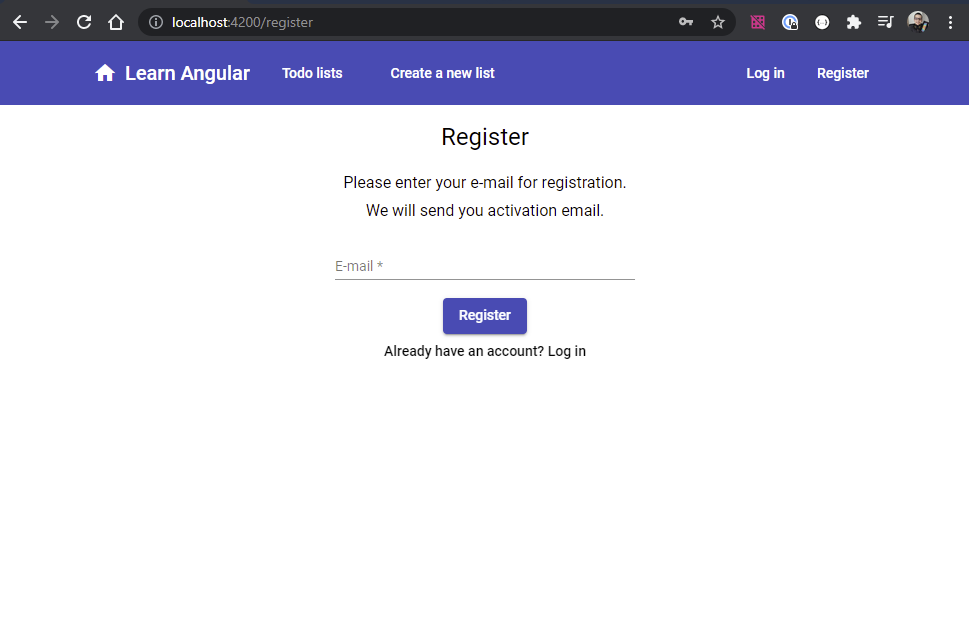

#### 1.1.2. Login

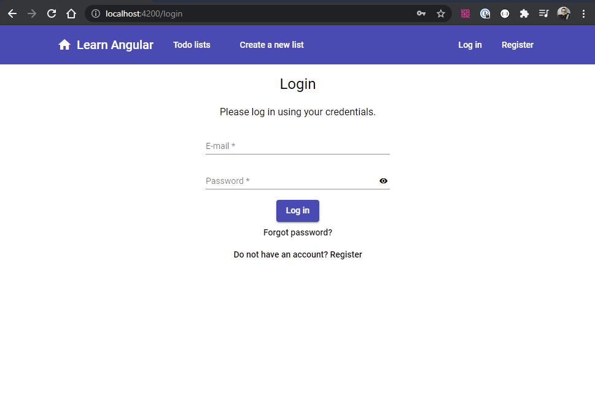

#### 1.1.3. Request password reset

Similar to registration, password reset sends an email with password reset link that includes a token. Again, no actual email is sent, you can get the link from the terminal log of the server.

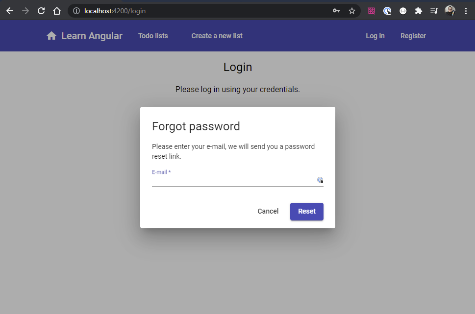

#### 1.1.4. Account activation

Account activation and password reset pages are a bit different from other pages - they do not have the same layout - there is no header component and the content of the page is centred in the middle of the screen. Think about how you can achieve this without having `if`s for hiding/showing elements or style adjustments.

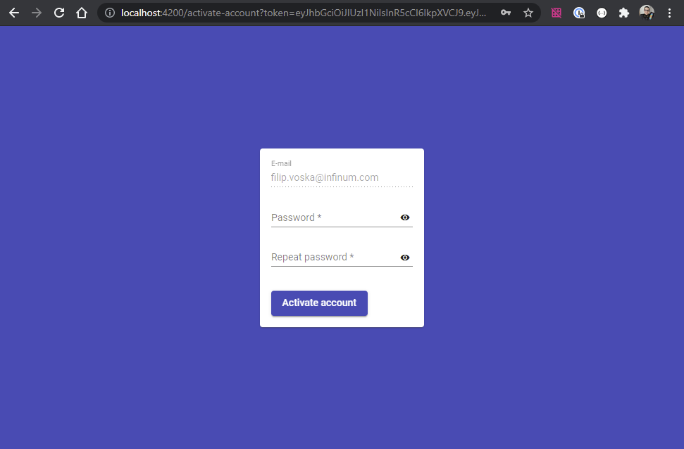

#### 1.1.5. Password reset

This page is opened once the user follows the link from request password reset email. URL contains a token similar to the one for activation. Again, more info about these tokens can be found in a later chapter.

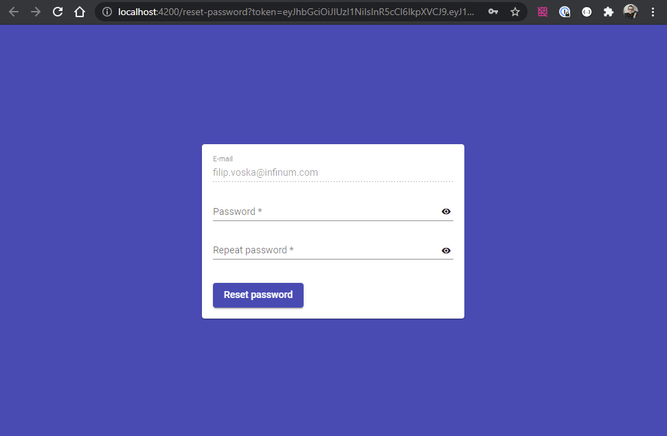

#### 1.1.6. User menu

Once the user is logged in, they can see their email in the header menu and trigger log out action from the dropdown menu that is opened when the user clicks on their email.

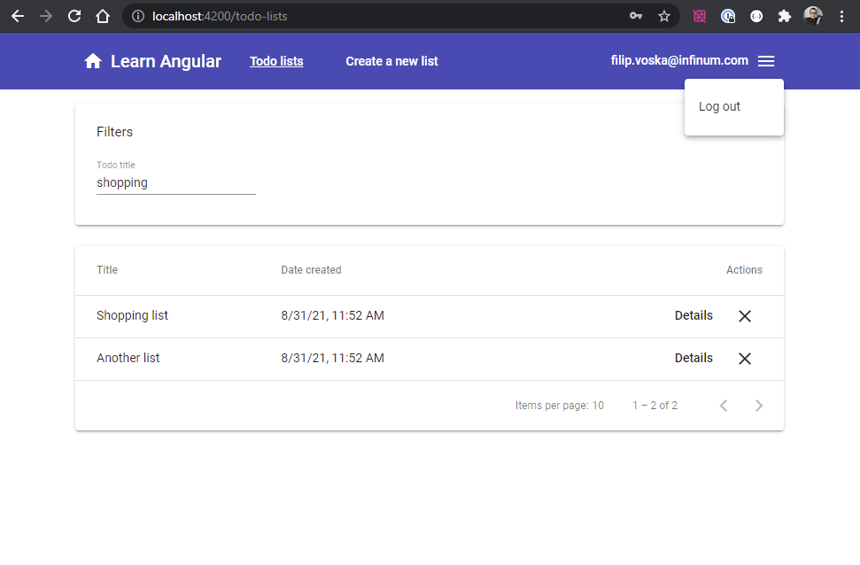

### 1.2. Managing Todos

All of the todo management routes should be protected with a guard that does not allow unauthorized users to see these pages. If an unauthorized user tries opening one of these routes, they should be redirected to login page.

#### 1.2.1. Table of Todo lists

This page shows a paginated table of all of the user's Todo lists:

- User can go to next/previous page
- User can sort Todo lists by name and creation date
  - Default sort: creation date, descending
- User can filter Todo lists by name
  - API calls should be made on-the-fly as the user types (there is no submit button), with some debounce time
  - Avoid making unnecessary API calls
  - Ensure that results from the API are processed in correct order and that there are no race conditions
- User should be able to both sort and filter simultaneously
- Pagination, sorting and filtering parameters should be preserved if:
  - The user refreshes the page
  - The user goes to some Todo details and comes back to the list
- Default page size should be 5
- Pagination component should show the total count of results
- User can navigate to edit page of a particular Todo
- User can delete a particular Todo (with confirmation dialog prompt)

##### Empty state:
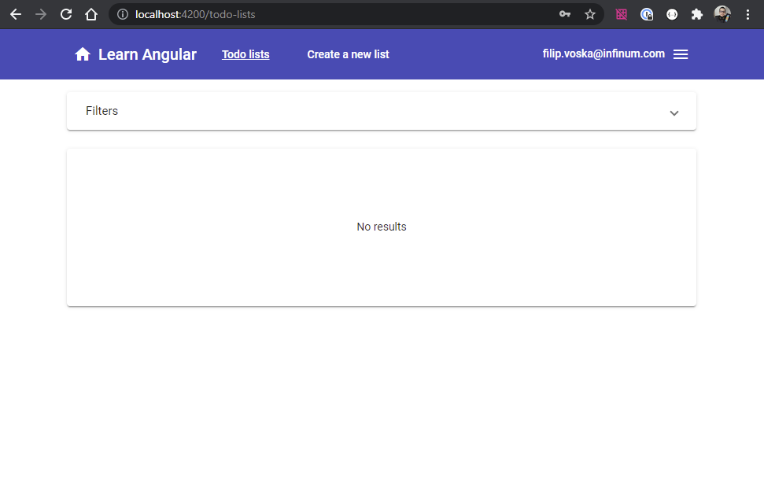

##### Table with some items:
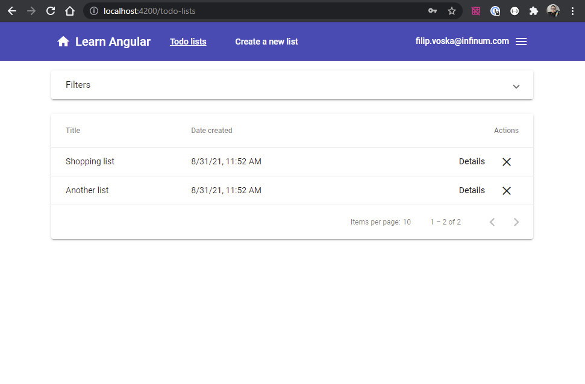

##### Sorted by name:
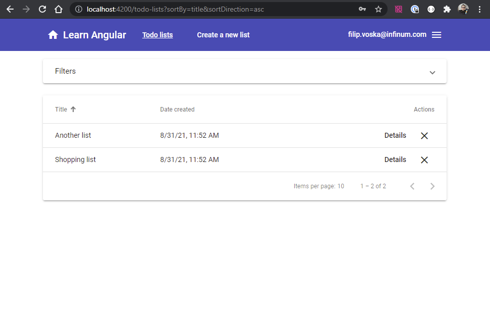

##### Name filter:
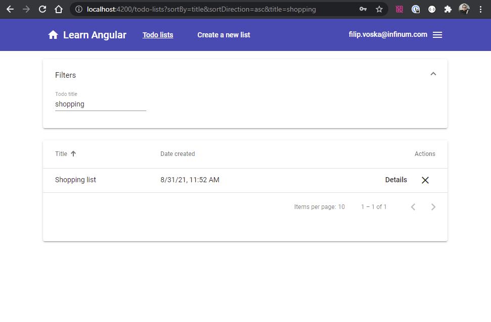

##### Delete action prompt:
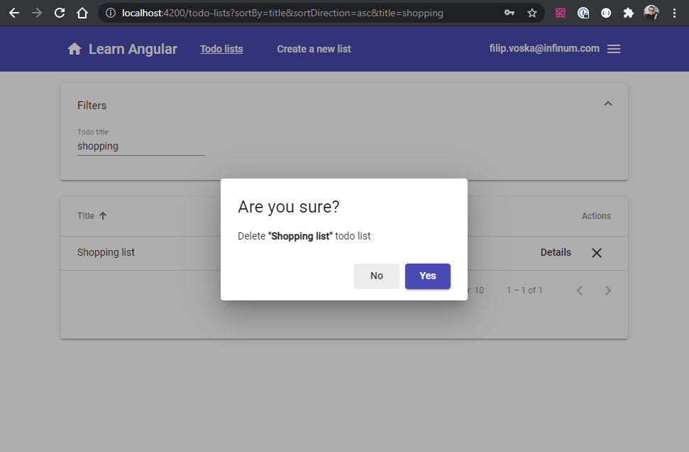


#### 1.2.2. Create a new Todo list

Todo form consists of:
- Todo list name
- Array of Todo items
  - Each Todo item has a name and done state

Please ensure that all the form validations are implemented:
- Todo list name is required
- At least one Todo item is required
- Todo item name is required

User should not be able to trigger an API call if the form is invalid.

##### Empty state
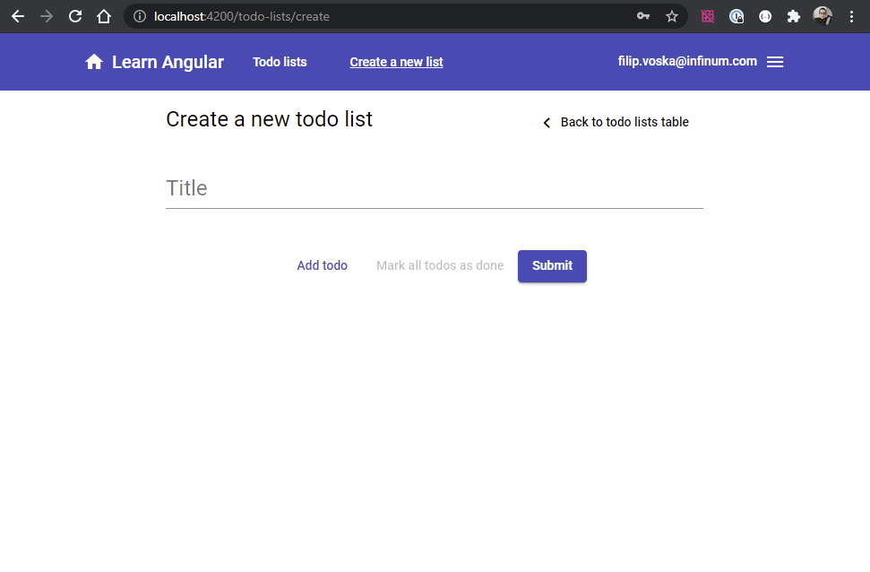

##### Filled out
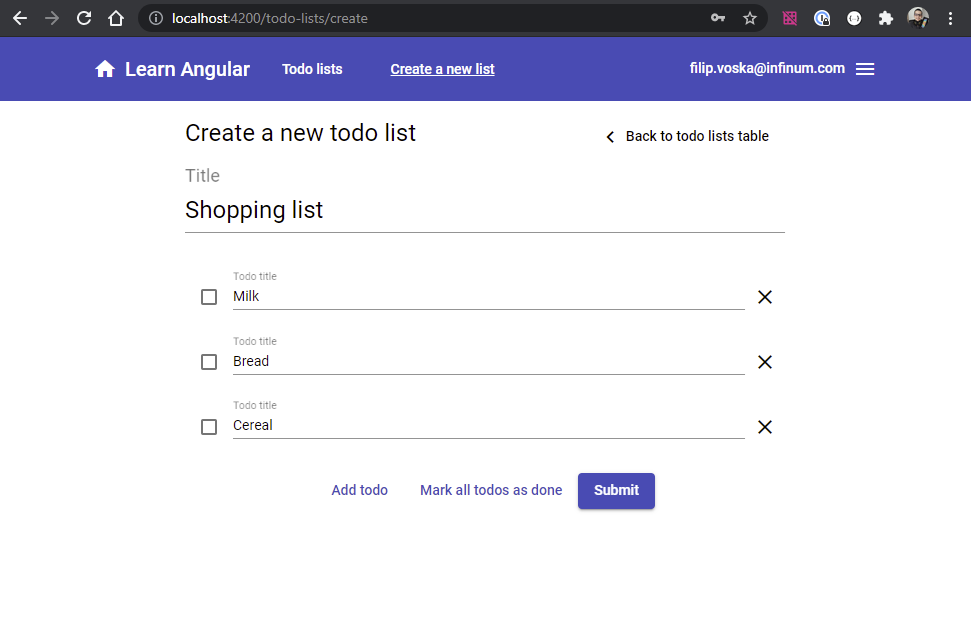

##### Validation error example #1
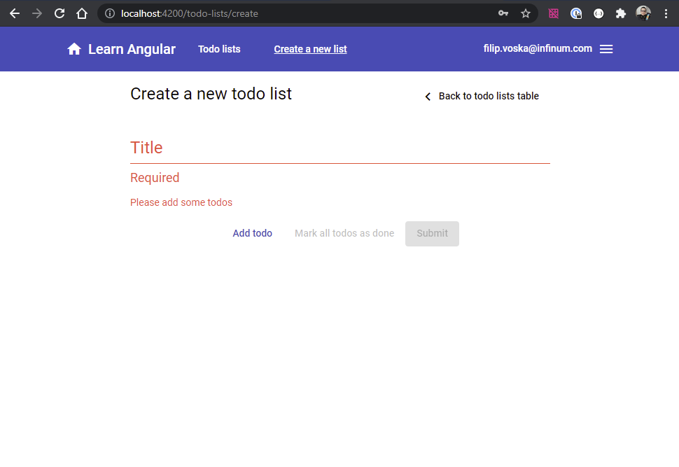

##### Validation error example #2
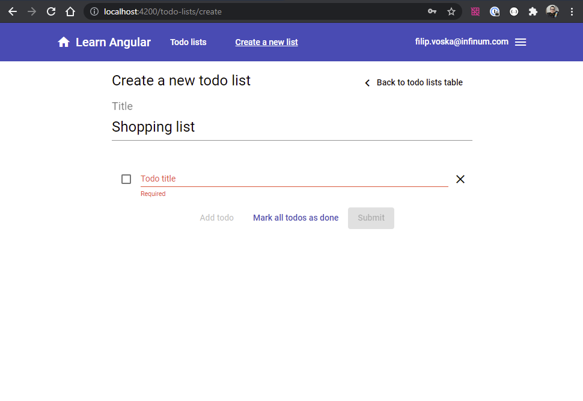

#### 1.2.3. Edit existing Todo list

When the users clicks "Details" action in the table, he is navigated to a particular Todo page where they can edit the Todo. The form is identical, but the API call is different. Find a way to re-use this form.

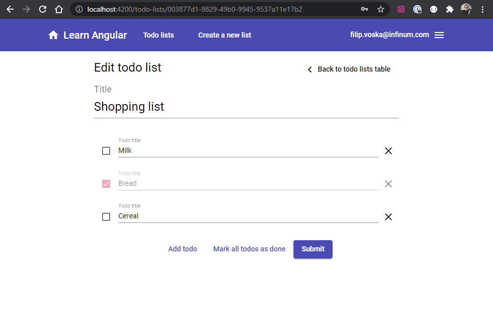
