# Notes for Next.js

Before you start, we suggest reading through our [Getting started with React](https://infinum.com/handbook/frontend/react/getting-started-with-react/ecosystem) guide. During development, we recommend referencing our more in-depth [React guidelines and practices](https://infinum.com/handbook/books/frontend/react/react-guidelines-and-best-practices) handbook.

You will build this app with Next.js framework so we also suggest you to go through official [Learn Next.js](https://nextjs.org/learn/basics/create-nextjs-app) tutorial.

If you need information about React core API be sure to check [React Docs](https://reactjs.org/) and for more hooks oriented docs check [React Beta Docs](https://beta.reactjs.org/).

## 1. Application requirements & notes

Please follow these requirements:

- Use React hooks
- Get familiar with [Chakra UI](https://chakra-ui.com) component library
- Use [SWR](https://swr.vercel.app/) hook for fetching data
  - Use use `fetcher` function abstraction located in `src/lib/fetcher.ts` and provide it globally with [Global Configuration](https://swr.vercel.app/docs/global-configuration)
- Use [useSWRMutation](https://swr.vercel.app/docs/mutation#useswrmutation) hook for mutating data.
  - Use `mutator` function abstraction located in `src/lib/mutator.ts` to perform `POST`, `PUT`, `PATCH`, `DELETE` actions.
- Use [React Hook Form](https://react-hook-form.com/) for handling forms
- Uee [React Hook Form - Error Message](https://github.com/react-hook-form/error-message)
- Use [React Hook Form - useFieldArray](https://react-hook-form.com/api/usefieldarray) for adding and removing todos
- Use [jwt-decode](https://github.com/auth0/jwt-decode) to parse data from tokens
- Get familiar with Next.js data fetching concepts:
  - Server Side Rendering (SSR): [getStaticProps](https://nextjs.org/docs/pages/building-your-application/data-fetching/get-server-side-props)
  - Static Site Generation (SSG): [getStaticProps](https://nextjs.org/docs/pages/building-your-application/data-fetching/get-static-props), [getStaticPaths](https://nextjs.org/docs/pages/building-your-application/data-fetching/get-static-paths)
  - Incremental Static Regeneration (ISR): [revalidate](https://nextjs.org/docs/pages/building-your-application/data-fetching/incremental-static-regeneration)
  - Client Side Rendering (CSR): [useSWR](https://swr.vercel.app/docs/with-nextjs)

Application UI structure:

- `Layout` component for sharing navigation between pages
  - `Navigation` component with application title and user menu
    - User menu shows `Log in` and `Register` links if the user is not logged in
    - User menu shows user's email and `Log out` button if the user is logged in
- `TodoLists` component for rendering, sorting, filtering and creation of paginated `TodoList` collection
- `TodoListDetails` component for preview and update `TodoList` details
- `TodoListForm` component which uses `useFieldArray` and `useForm` for handling form inputs, and `useSWRMutation` to handle mutations

> Check the [Project structure](https://infinum.com/handbook/frontend/react/project-structure) Handbook for better understanding

API Development proxy setup:

To make it work you just need to duplicate `.env.example` file, rename it to `.env.local`.
If you need more info about the setup you can find it here [here](https://infinum.com/handbook/frontend/react/next/development-proxy).

### 1.1. Authorization flow

If a logged in user tries to navigate to some of authorization pages, they should be redirected to the homepage, since it does not make sense for logged in user to see the login page.

If a logged out user tries to navigate to some of the pages that require login, they should be redirected to the login page.

#### 1.1.1. Registration

During registration, user enters only their e-mail address. An email is sent with activation link that the user can click. This link contains a token that you can read more about in a later section of this readme.

You should implement the following pages:

- Registration - `/register`
  - Should show a link to `/login` route
- Account activation - `/activation?token=...`
- Log in - `/login`
  - Should show links to `/register` and `/forgot-password` routes
- Forgot password - `/forgot-password`
- Reset password - `/reset-password?token=...`

Additional notes:

- User should be able to log out
- Application should load user data upon full page reload
  - Utilize `GET` `/auth/user` API call and think about what is the best way to load user data during app initialization
  - implement `useUser` hook that uses `useSWR` under the hood to leverage `caching` and API calls `deduping`
  - use `fetcher` function abstraction located in `src/lib/fetcher.ts` to handle API calls. You can provide it globally with `SWRConfig` [Global Configuration](https://swr.vercel.app/docs/global-configuration)
- If user enters `/login` route while already logged in, he should be redirected to `/`
  - implement `AuthRedirect` component based on the handbook tutorial [Session Handling](https://infinum.com/handbook/frontend/react/recipes/session-handling)
- If user enters any secure route (e.g. `/`, `/:uuid`) while not logged in, he should be redirected to `/login`
  - use the same `AuthRedirect` utility component

_Note_: Backend server that is running locally does not sent an actual email. Activation link can be seen in terminal log of the server.

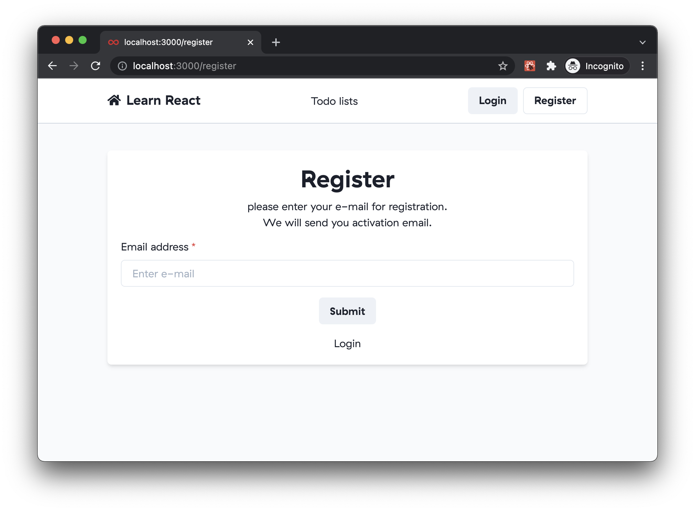

#### 1.1.2. Login

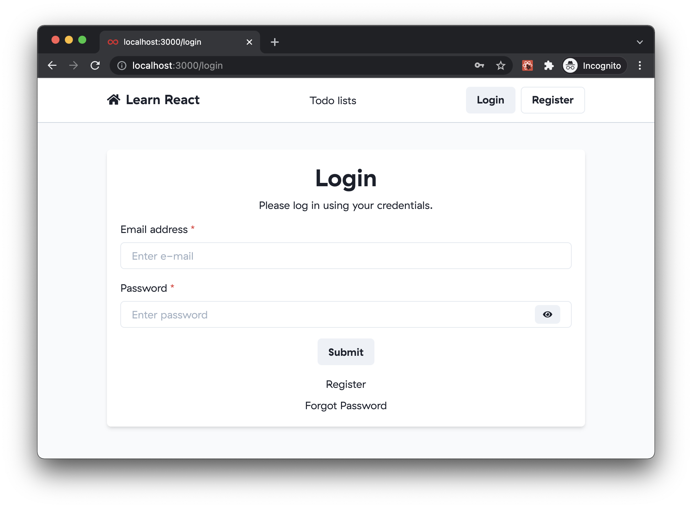

#### 1.1.3. Request password reset

Similar to registration, password reset sends an email with password reset link that includes a token. Again, no actual email is sent, you can get the link from the terminal log of the server.

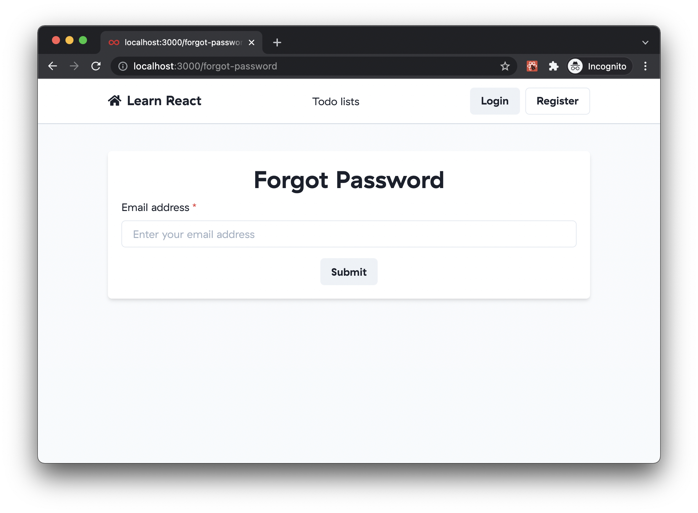

#### 1.1.4. Account activation

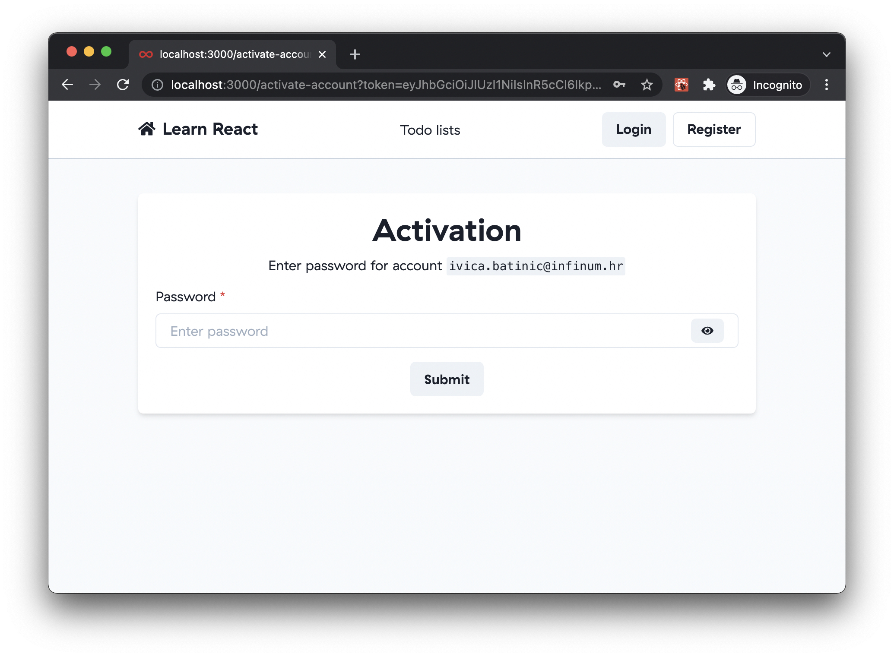

#### 1.1.5. Password reset

This page is opened once the user follows the link from request password reset email. URL contains a token similar to the one for activation. Again, more info about these tokens can be found in a later chapter.

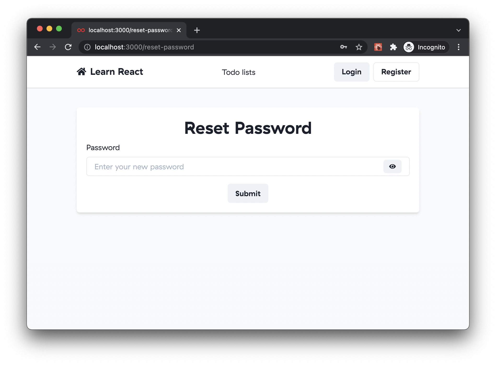

#### 1.1.6. User menu

Once the user is logged in, they can see avatar icon in the header menu and trigger log out action from the dropdown menu that is opened when the user clicks on their email.

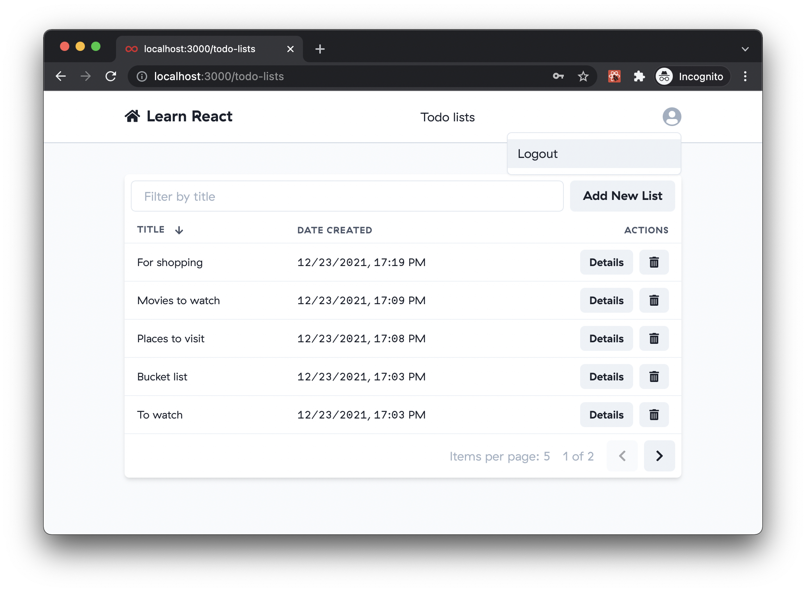

### 1.2. Managing Todos

All of the todo management routes should be protected with a guard that does not allow unauthorized users to see these pages. If an unauthorized user tries opening one of these routes, they should be redirected to login page.

#### 1.2.1. Table of Todo lists

This page shows a paginated table of all of the user's Todo lists:

- User can go to next/previous page
- User can sort Todo lists by name and creation date
  - Default sort: creation date, descending
- User can filter Todo lists by name
  - API calls should be made on-the-fly as the user types (there is no submit button), with some debounce time
  - Avoid making unnecessary API calls
  - Ensure that results from the API are processed in correct order and that there are no race conditions
- User should be able to both sort and filter simultaneously
- Pagination, sorting and filtering parameters should be preserved if:
  - The user refreshes the page
  - The user goes to some Todo details and comes back to the list
- Default page size should be 5
- Pagination component should show the total count of results
- User can navigate to edit page of a particular Todo
- User can delete a particular Todo (with confirmation dialog prompt)

##### Empty state

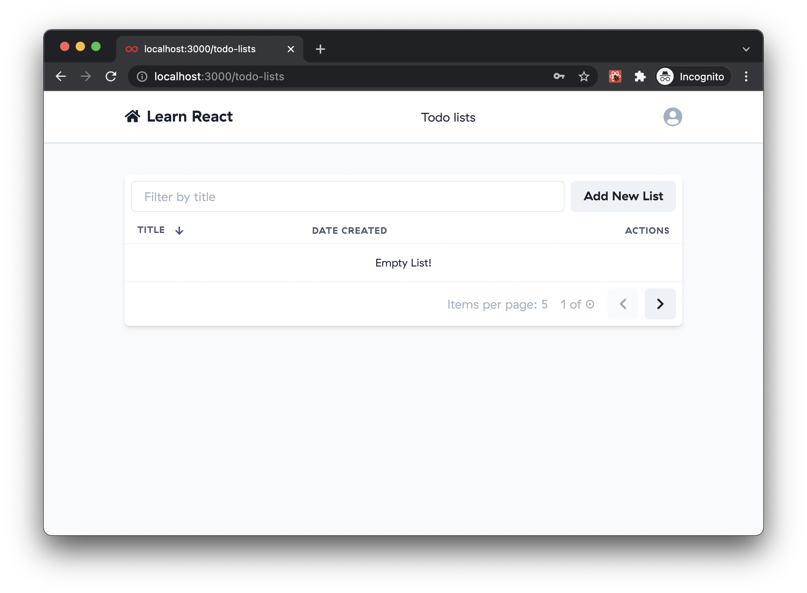

##### Table with some items


##### Sorted by title

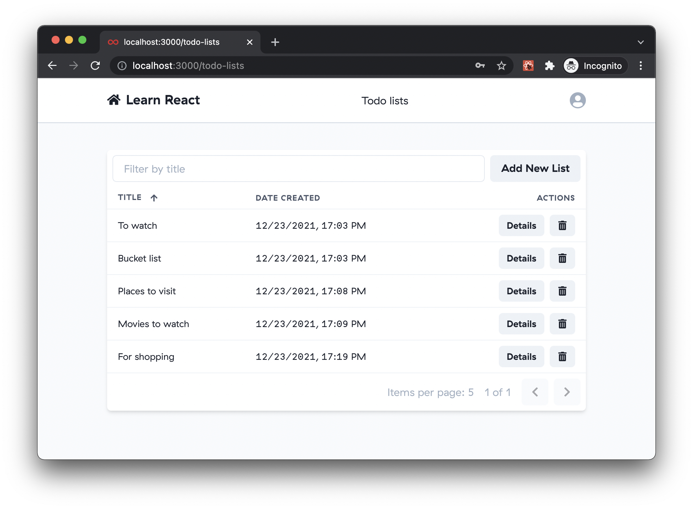

##### Filters

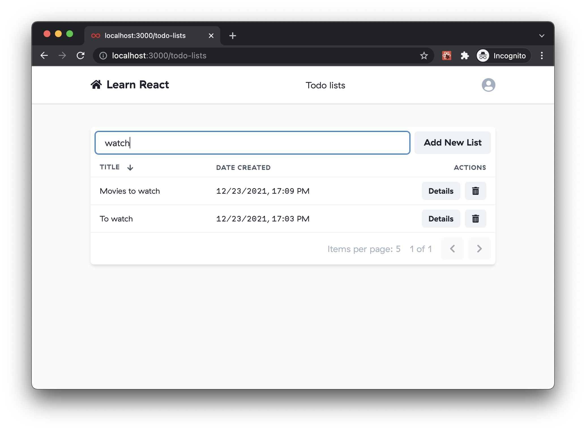

##### Delete action prompt

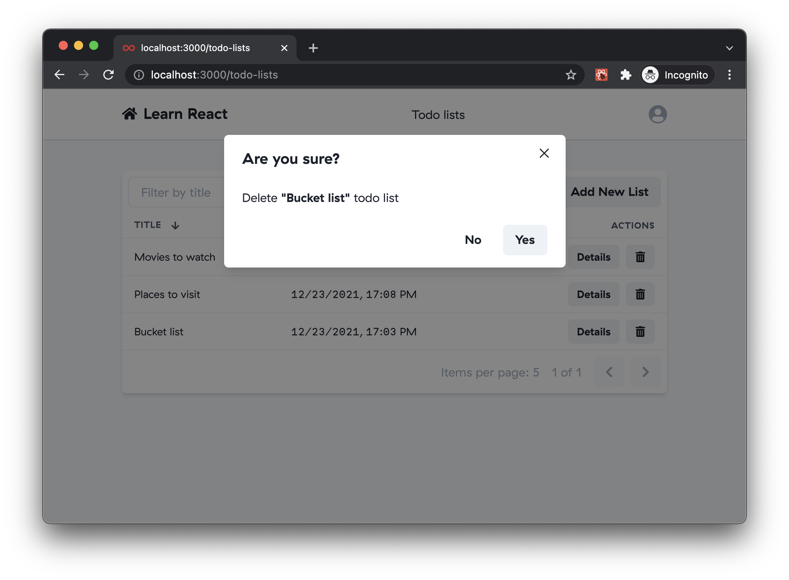

#### 1.2.2. Create a new Todo list

Todo form consists of:

- Todo list name
- Array of Todo items
  - Each Todo item has a name and `done` state

Please ensure that all the form validations are implemented:

- Todo list name is required
- At least one Todo item is required
- Todo item name is required

User should not be able to trigger an API call if the form is invalid.

Think about how to design component API and break it in multiple parts so you can compose both create and edit forms from the same components.

Suggested composition:

- `TodoForm` component that is responsible for rendering the form
- `TodoFormFields` component that is responsible for rendering the form fields
- `TodoFormSubmit` component that is responsible for rendering the form submit button

Things to investigate:

- [useFieldArray](https://react-hook-form.com/api/usefieldarray/) hook. It will help you with managing the array of Todo items.
- [FormProvider](https://react-hook-form.com/api/formprovider/) and [useFormContext](https://react-hook-form.com/api/useformcontext/) hooks. They will help you with re-using the form for both create and edit actions.
- [Multipart Component](https://kentcdodds.com/blog/compound-components-with-react-hooks) also known as Compound Components. It will help you with re-using the form for both create and edit actions.

##### Empty state

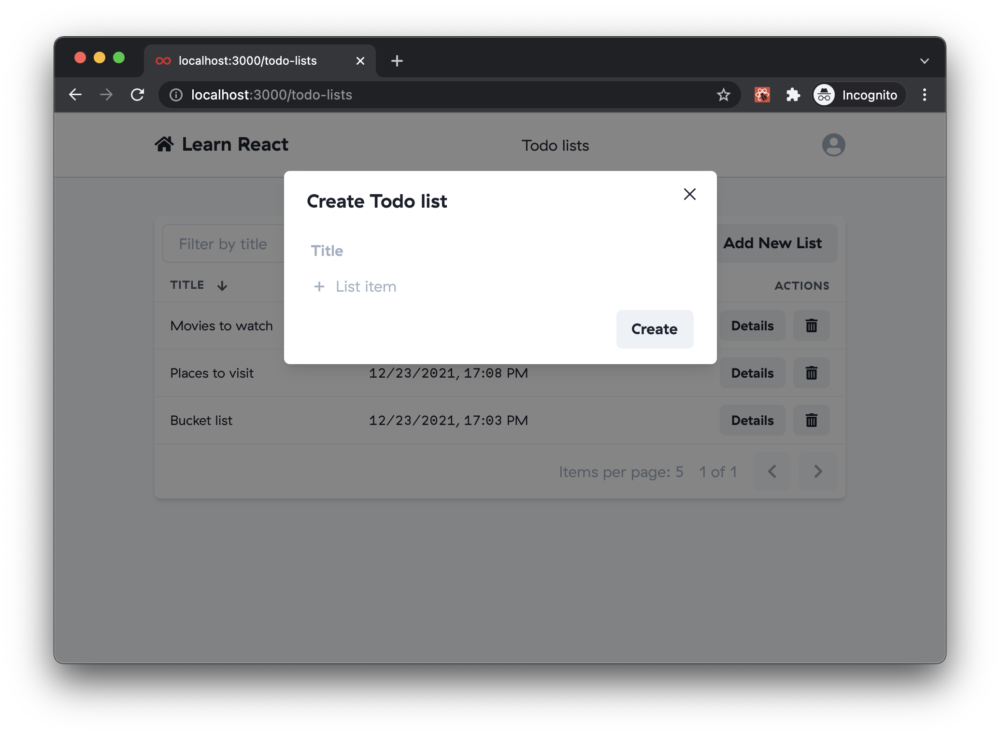

##### Filled out

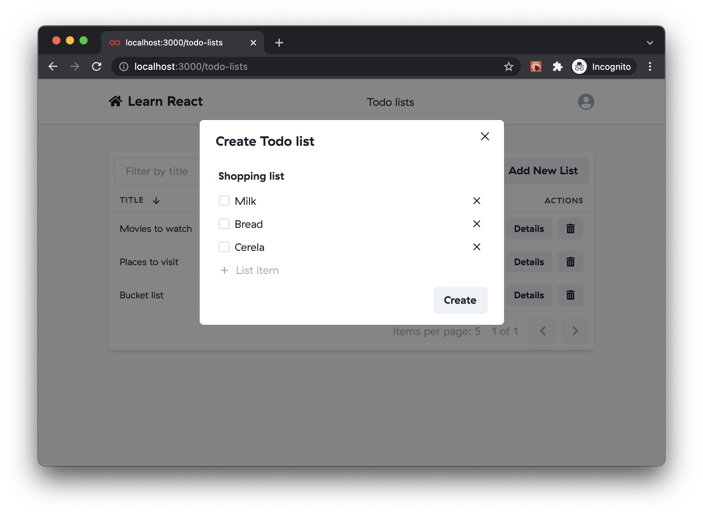


##### Validation error example #1

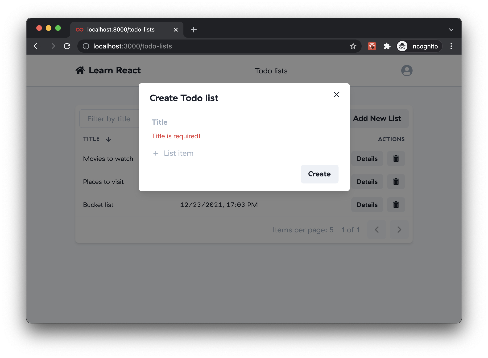

#### 1.2.3. Edit existing Todo

When the users clicks "Details" action in the table, he is navigated to a particular Todo page where they can edit the Todo. The form is identical, but the API call is different. Find a way to re-use the form form the Create Todo modal.

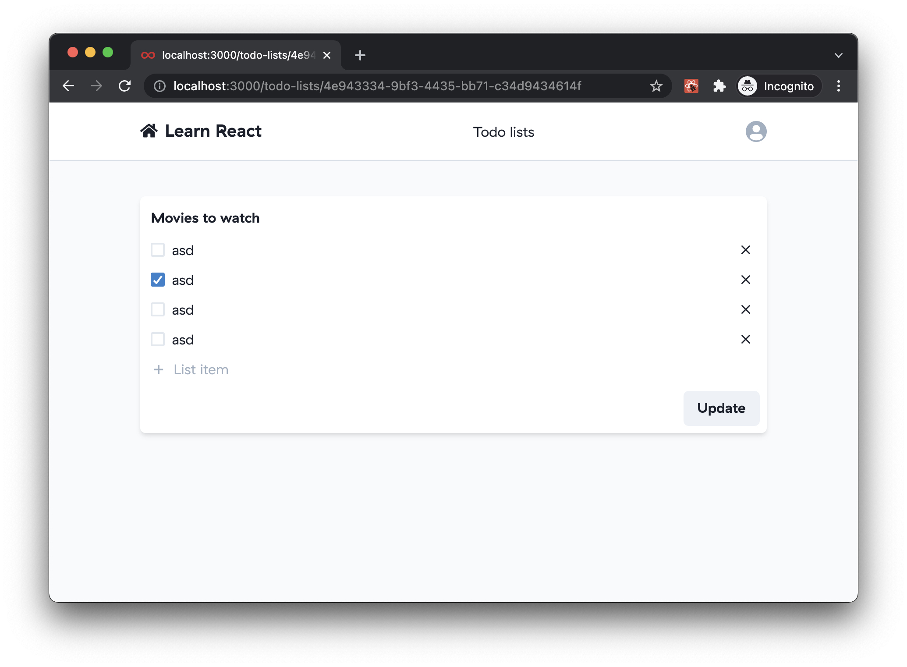

## 1.3. Server side rendering

Server side rendering is a technique that allows us to render the initial HTML on the server and send it to the client. This is useful for SEO purposes and for improving the performance of the initial page load.

Common pitfalls & tricks:

- Cookies are not sent to the server by default. You need to explicitly send them with the request. You can read the existing cookie form the [context](https://nextjs.org/docs/pages/api-reference/functions/get-server-side-props#context-parameter) `req` object and send it with the request.
- You need to send the request to the API server, not the Next.js server.
- You need to handle [notFound](https://nextjs.org/docs/pages/api-reference/functions/get-server-side-props#notfound) and [redirects](https://nextjs.org/docs/pages/api-reference/functions/get-server-side-props#redirect) on the server.

### 1.3.2. Todo list

Implement server side rendering for Todo list page that we implemented in the previous chapter. You should use [getServerSideProps](https://nextjs.org/docs/pages/building-your-application/data-fetching/get-server-side-props) function to fetch the data on the server. 

Use `fetcher` function form `src/lib/fetcher.ts` directly because you can't use SWR on the server. Make sure to pass cookie headers to the second parameter of the `fetcher` function.

Construct the `fallback` object with the key-value paris, where `key` is the URL and `value` is the raw response, and pass it to the `SWRConfig` component.

```tsx
// src/pages/index.tsx
import { SWRConfig } from 'swr';
import { fetcher } from '../lib/fetcher';

const Home = ({ fallback }) => {
  return (
    <SWRConfig value={{ fallback }}>
      <Todos />
    </SWRConfig>
  )
};

export const getServerSideProps = async ({ req }) => {
  const cookies = req.headers.cookie;
  const todosKey = todosQuery();
  const todos = await fetcher(todosKey, {
    headers: {
      cookie: cookies,
    },
  });

  return {
    props: {
      fallback: {
        [todosKey]: todos,
      },
    },
  };
}

export default Home;
```

Redirect to the login page if the user is not authenticated.

```tsx

export const getServerSideProps = async ({ req }) => {
  const cookies = req.headers.cookie;
  const userKey = userQuery();

  let user;
  try {
    user = await fetcher(userKey, {
      headers: {
        cookie: cookies,
      },
    });
  } catch (error) {
    return {
      redirect: {
        destination: '/login',
        permanent: false,
      },
    };
  }

  //...
}
```

### 1.3.3. Todo details

Do the same as above, but for the Todo details page. Red the `id` from the context `req` and fetch the Todo details from the API server.

```tsx
// src/pages/[id].tsx

export const getServerSideProps = async ({ req }) => {
 //...

  const id = req.query.id;
  const todoKey = todoQuery(id);

  const todo = await fetcher(todoKey, {
    headers: {
      cookie: cookies,
    },
  });

  //...
};
```

## 1.4. Testing

Write some tests, for example:

- TodoFormFields
  - `should show title`
  - `should update title`
  - `should mark as done`
  - `should handle removing`

- TodoList
  - `should show empty state`
  - `should show list of items`
  - `should show pagination`
  - `should show sorting`
  - `should show filtering`
  - `should show delete confirmation`
  - `should delete item`
  - `should navigate to edit page`

> **Note:** Test cases above are just examples. Real test cases depends on how you implement the components, but they should should be similar to the ones above. Fell free to add more test cases.
