# Just Todo It — Requirements

This document describes **what** the app must do, whichever framework you're on. It says nothing about **how**. Libraries, component structure, state management and file layout are your decisions. Expect to explain them in review.

Each section lists behaviours and acceptance criteria. A requirement is met when every acceptance criterion under it can be shown to hold, by you, your tests or your reviewer. Framework-specific notes (scaffolding, optional suggestions, concepts you'll be asked to explain) are in [Nextjs.md](./Nextjs.md) and [Angular.md](./Angular.md).

> **Screenshots are reference, not spec.** They show one possible layout and the states the app has to handle. Use them as a visual target for content and states. Pixel-matching them is not a requirement: they come from an older version of the app built with Chakra UI, so your app won't look like them. The Next.js set is embedded below. The Angular set is in [`.assets/app/angular/`](./.assets/app/angular/), together with a [demo video](./.assets/app/angular/demo.mp4).

The API you build against is in `api/` and documented in the [README](./README.md#4-api). Treat it as a third-party API you don't control. Its [constraints](./README.md#44-constraints-to-design-around) (replace-all updates, the total count in a response header, 1-indexed pages) are part of the problem you're solving.

## 1. Auth flow & routes

### 1.1. Session

- The session is the API's HTTP-only `token` cookie. The app never stores the token where JS can read it and never sends an `Authorization` header. Any server-side call that forwards the cookie also passes refreshed `Set-Cookie` headers back to the browser.
- Every API request that needs the session sends the cookie (including cross-origin requests from the app's origin to the API).

Acceptance criteria:

- After login, a full page reload keeps the user logged in.
- On a full page reload the app knows who the user is **before** it renders anything that depends on it. A logged-in user never sees a flash of the logged-out UI, such as the "Log in" link or the login page.
- A `401` from any authenticated request (not login, and not the initial who-am-I check on public pages) logs the user out and sends them to `/login`.

### 1.2. Redirects

- A **logged-out** user who opens a page that requires login (the Todo list table, a Todo list's details) is redirected to `/login`.
- A **logged-in** user who opens an auth page (`/login`, `/register`, `/forgot-password`, `/activate-account`, `/reset-password`) is redirected to `/`.

Acceptance criteria:

- Both redirects work on a full page reload / direct URL entry, not only on in-app navigation.
- No protected content and no API data is shown to a logged-out user, not even for a moment before the redirect.

### 1.3. Pages

| Route                          | Purpose                                                                                      |
| ------------------------------ | -------------------------------------------------------------------------------------------- |
| `/register`                    | User registers with their email only. Links to `/login`.                                     |
| `/activate-account?token=...`  | User opens the link from the activation email, sets a password and activates the account.    |
| `/login`                       | User logs in with email and password. Links to `/register` and `/forgot-password`.           |
| `/forgot-password`             | User enters their email to receive a password reset link.                                    |
| `/reset-password?token=...`    | User opens the link from the reset email and sets a new password.                            |

Acceptance criteria:

- Registration asks only for an email. On success the user is told to check their email.
- The activation and reset pages read the token from the URL. An expired or invalid token shows a clear error instead of a broken form.
- Activation and reset both collect a new password, with the same fields and the same validation messages. The API has no password rules of its own, so any rules are yours to choose; apply the same ones in both places.
- Each form shows the API's error responses (e.g. email already taken, wrong credentials, an expired activation or reset link) as a readable message, not a raw error.
- After successful activation or password reset, the user ends up logged in or on the login page. Pick one and be consistent.
- Locally the API doesn't send real emails. The activation and reset links are printed in the API server's terminal.

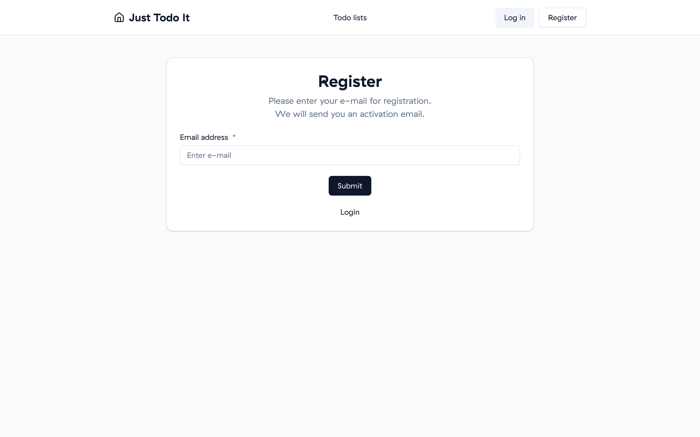

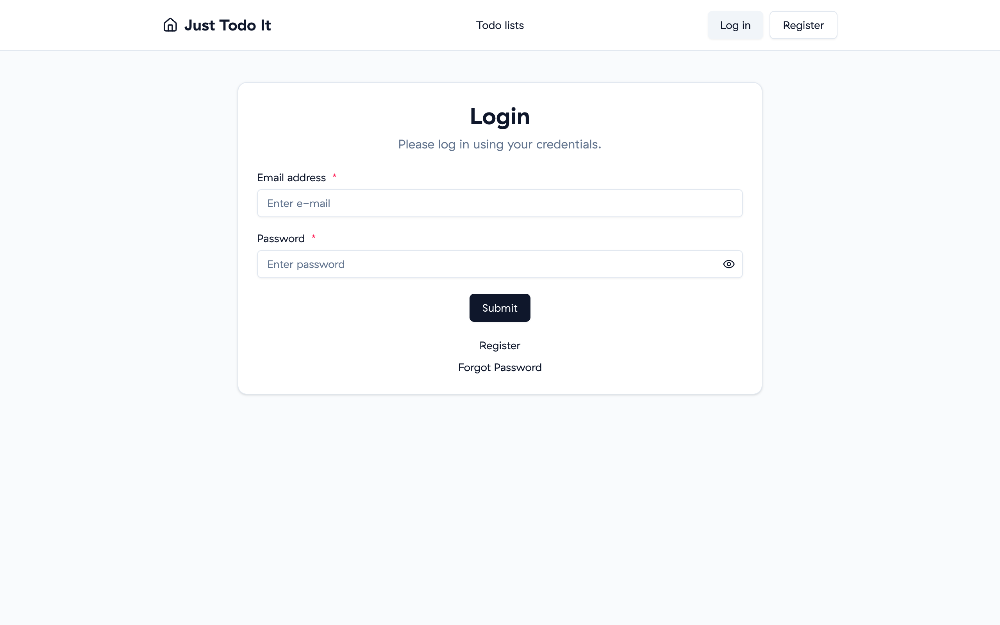

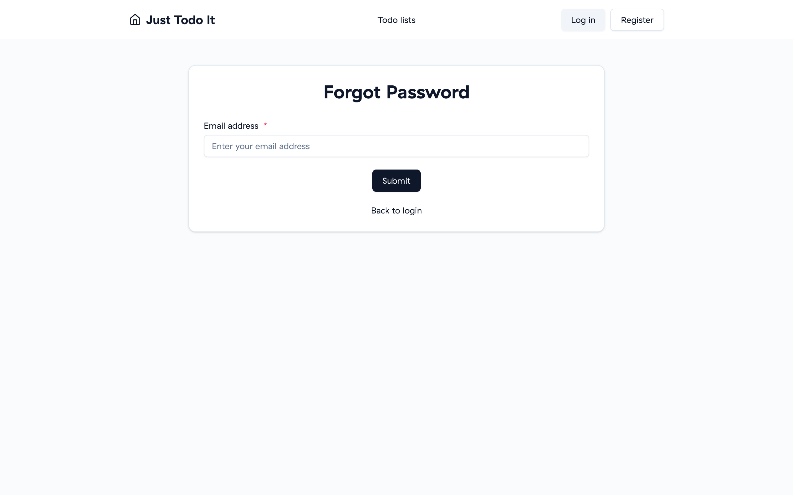

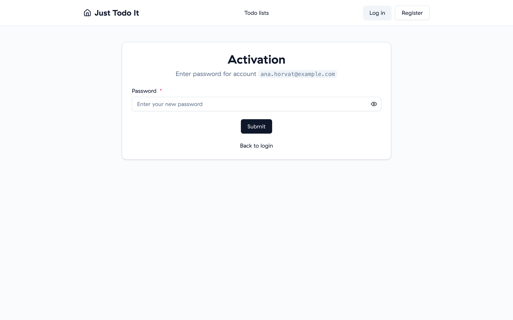

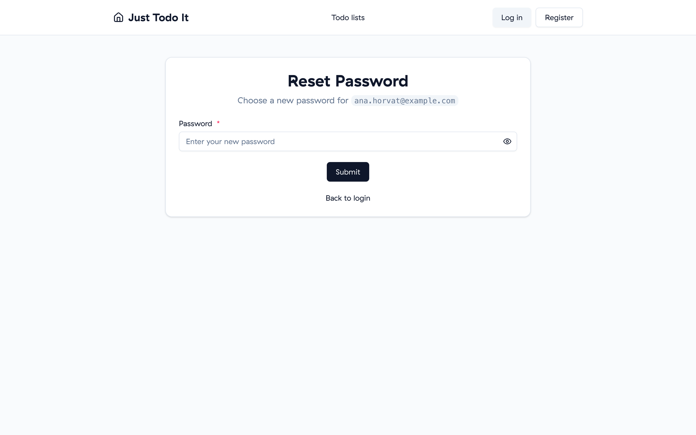

## 2. User menu

A header is shared by the app's main pages and shows the app title and a user menu.

Acceptance criteria:

- Logged out: the menu shows **Log in** and **Register** links.
- Logged in: the menu shows the user's email. A dropdown opened from it has a **Log out** action.
- Log out calls the API to clear the session cookie (the app can't clear an HTTP-only cookie itself), then takes the user to `/login`. After logout, the browser's back button doesn't show protected content.

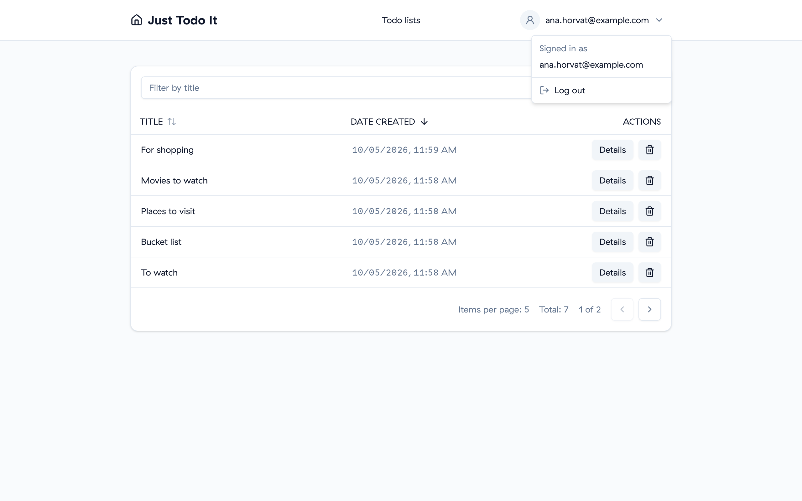

## 3. Todo list table

The home page (`/`) requires login and shows a paginated table of the logged-in user's Todo lists.

Acceptance criteria:

- **Pagination:** the user can go to the next and previous page. Default page size is **5**. The pagination shows the **total count** of results. Next/previous are disabled when there's no next/previous page.
- **Sorting:** the user can sort by name and by creation date, in both directions. Default sort is **creation date, descending**.
- **Filtering:** the user can filter by name. Results update as the user types, with no submit button.
  - Requests are debounced. Typing a word makes one request after the user pauses, not one per keystroke.
  - No unnecessary requests: changing the input and restoring it before the debounce fires sends nothing.
  - **No race conditions:** the table always shows the results for the latest input, even if an earlier, slower response arrives after a later one.
  - Changing the filter resets to the first page.
- Sorting and filtering work together, with pagination on top of both.
- **State is preserved:** page, sort and filter survive:
  - a full page reload, and
  - going to a Todo list's details and coming back (including via the browser back button).
- The URL is the source of truth for this state. Copying the URL into a new tab shows the same table.
- **Empty state:** when the user has no Todo lists, or none match the filter, the table shows a clear empty state instead of an empty grid.
- **Details:** each row lets the user open that Todo list's details page (`/<uuid>`).
- **Delete:** each row lets the user delete that Todo list. Deleting asks for confirmation first, and cancelling leaves everything unchanged. After deleting, the table reflects the change (including the total count and staying on a valid page).
- **Create:** the user can start creating a new Todo list from this page (see [section 4](#4-todo-list-form-create--edit)).

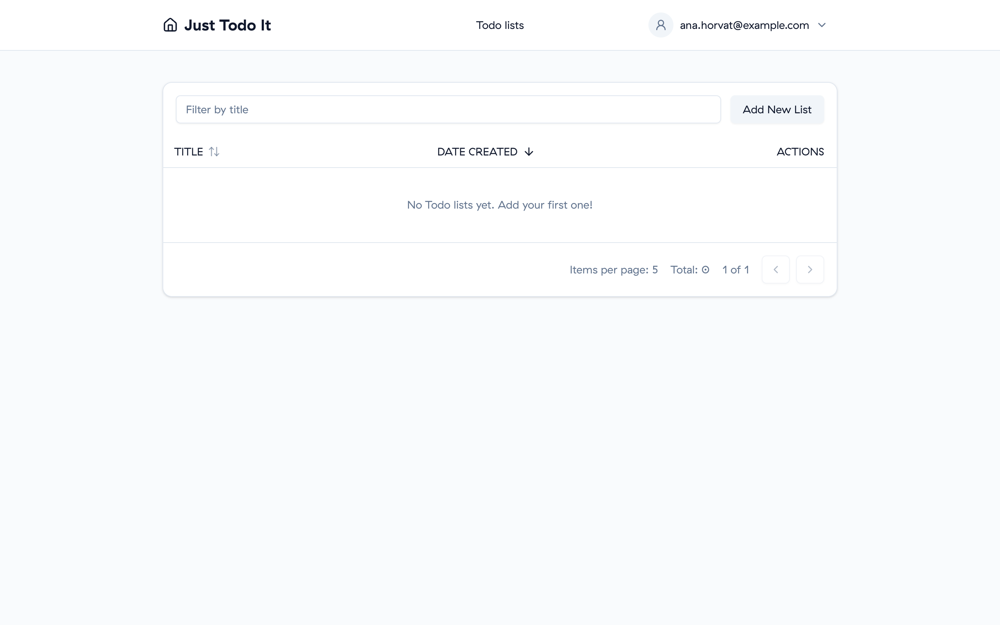

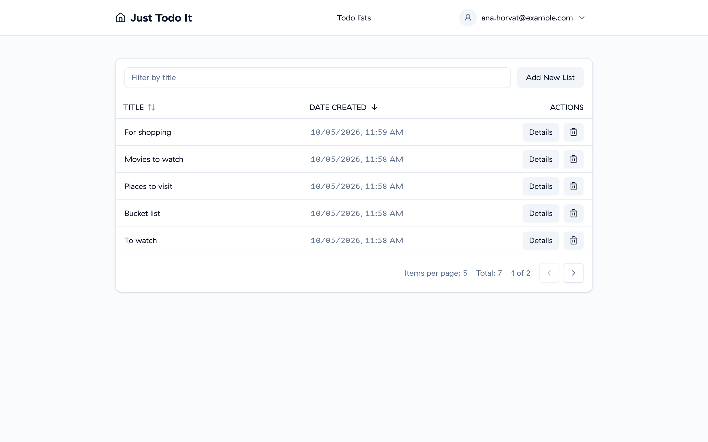

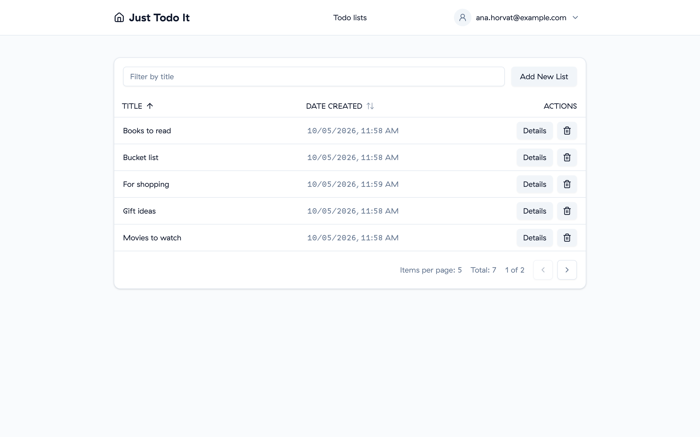

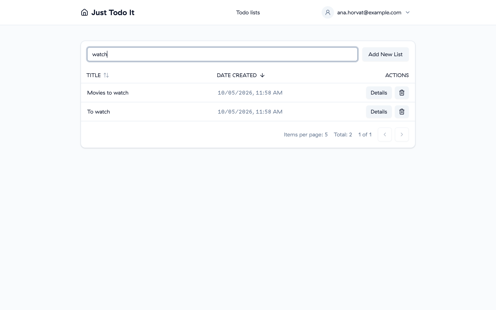

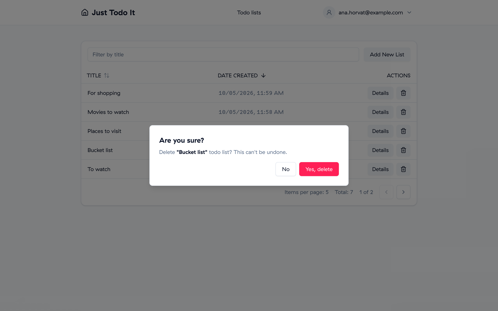

## 4. Todo list form (create & edit)

A Todo list has a **name** and one or more **items**. Each item has a **name** and a **done** state. The API calls a name `title`.

Acceptance criteria:

- **Validation:**
  - The list name is required.
  - At least one item is required.
  - Every item name is required.
  - Validation errors are shown next to the field they belong to.
- **No API call is made while the form is invalid.** Submitting an invalid form only shows the errors.
- The user can add items, remove items, rename items and toggle an item's done state before submitting.
- **Create:** creating a list adds it to the table. A name the user has already used shows a readable error.
- **Edit:** the details page (`/<uuid>`) shows the same form, pre-filled with the list's current name and items. Saving updates the list.
  - The API replaces **all** of a list's items on every update. The app must send the complete set of items so that none are lost or duplicated.
  - Opening the details page of a list that doesn't exist, or isn't the user's, shows a not-found state.
- **Create and edit use the same form:** the same fields, the same validation messages and the same item add/remove behaviour. Only the initial values and the submit action differ. How you share it between the two is up to you, and it's a good candidate for a PR decision.

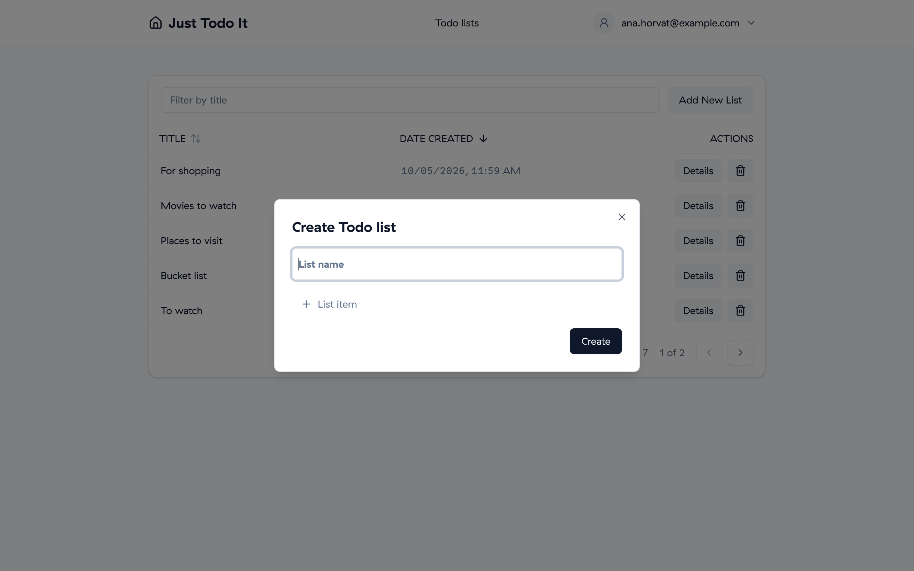

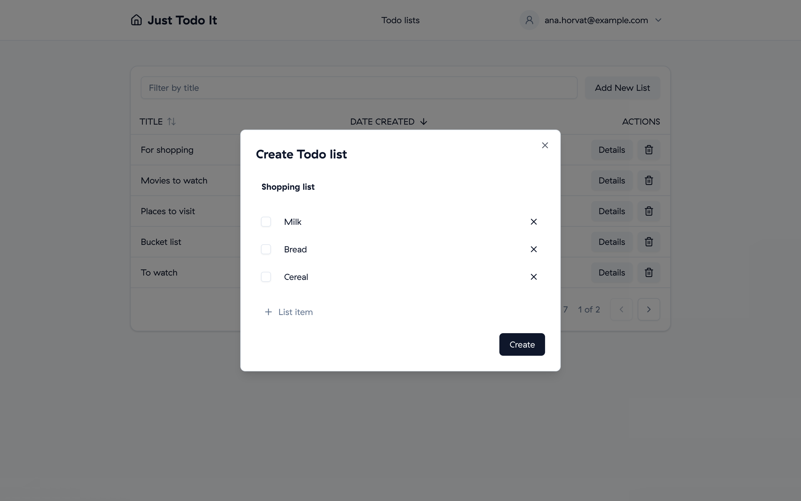

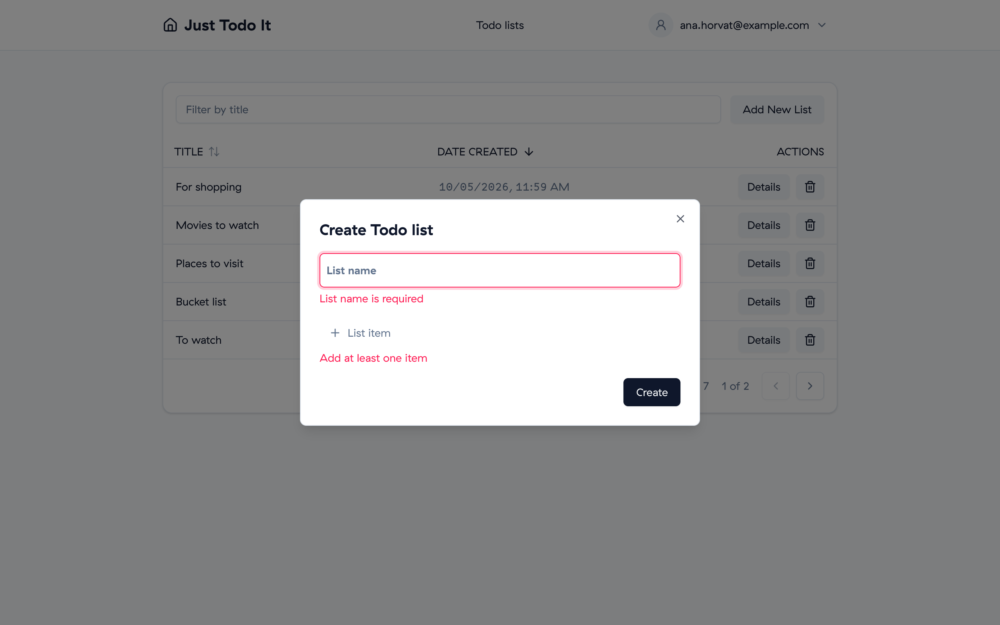

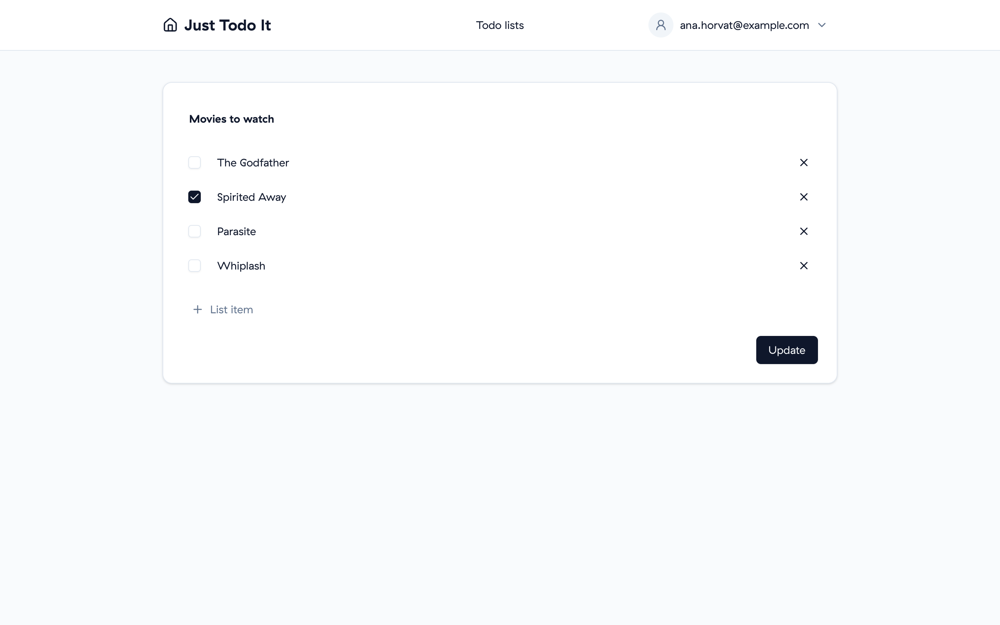

## 5. Testing expectations

You choose the tools and the structure. The following behaviours must be covered by automated tests that exercise them the way a user would, not by testing implementation details:

- **Todo list form:**
  - shows validation errors, and makes no API call when the name is empty, there are no items, or an item has no name
  - adds and removes items
  - renames an item and toggles its done state
  - submits the expected payload in create mode and in edit mode
- **Todo list table:**
  - shows the empty state
  - shows the user's Todo lists
  - pagination moves between pages and shows the total count
  - sorting changes the order
  - filtering is debounced, and a slow earlier response doesn't overwrite a later one
  - delete asks for confirmation, then deletes
  - a row leads to that list's details page
- **Auth:**
  - at least the redirect rules from [section 1.2](#12-redirects), in both directions

Tests run with a single command and pass on a clean checkout.

## 6. Code-quality expectations

- Linting and type-checking pass with no errors.
- Both run automatically **before every commit**, so a commit with lint or type errors can't be made by accident.
- A formatter is configured, and a format check runs before every commit as well.
- Tests pass before a PR is opened.
- Every PR uses the repository's PR template: what changed, the decisions you made (with the options you considered and the trade-offs), open questions, and confirmation that you ran the self-review. See the [README](./README.md#5-how-review-works-decisions-over-code).
